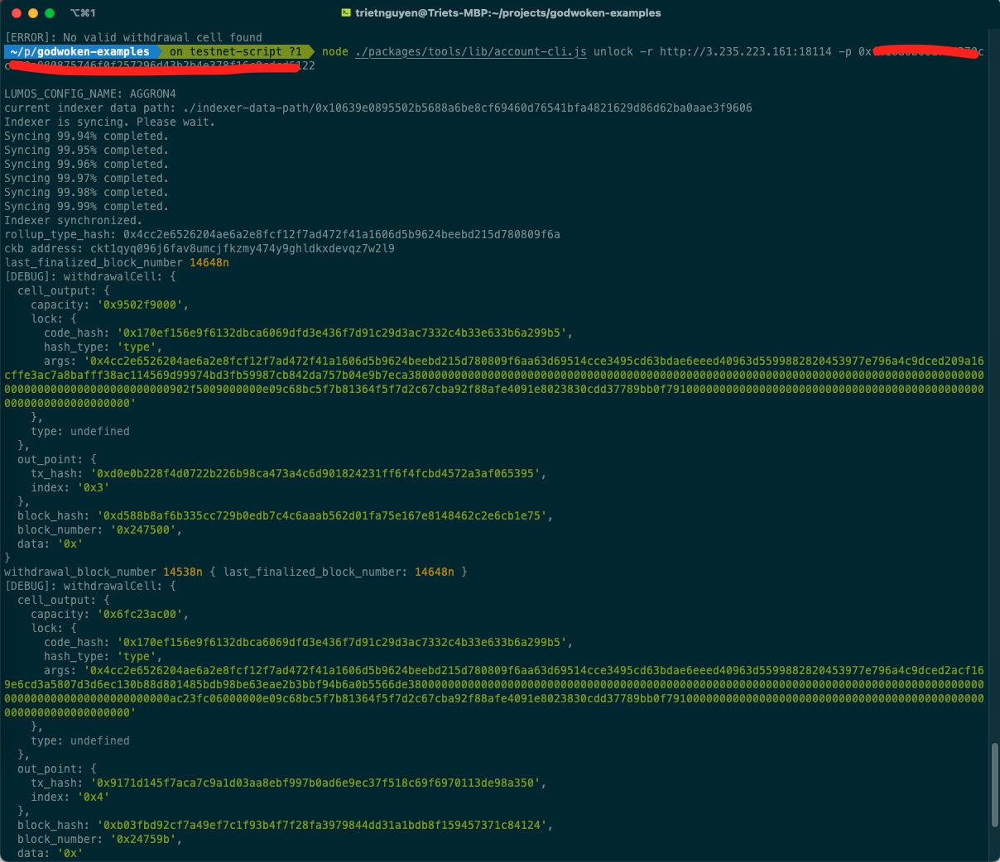
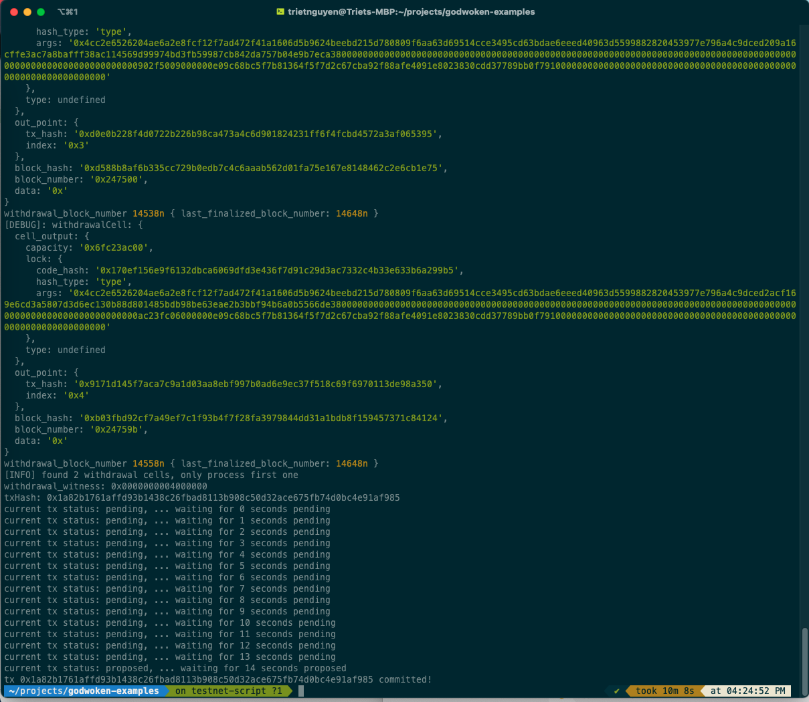

## 1. A screenshot of the console output immediately after running the withdraw command.
### A screenshot of the console output immediately after running the "unlock" command: 




## 2. The Ethereum address that you've used for your Layer 2 account (in text format):
```sh
0x354a6780Ae7373684F1cdd8F2b86D597c3B7ccb5
```
## 3. The Nervos Layer 1 address associated with the private key passed to "unlock" command (in text format). This is "ckb address" in the console output
```sh
ckt1qyq096j6fav8umcjfkzmy474y9ghldkxdevqz7w2l9
```
