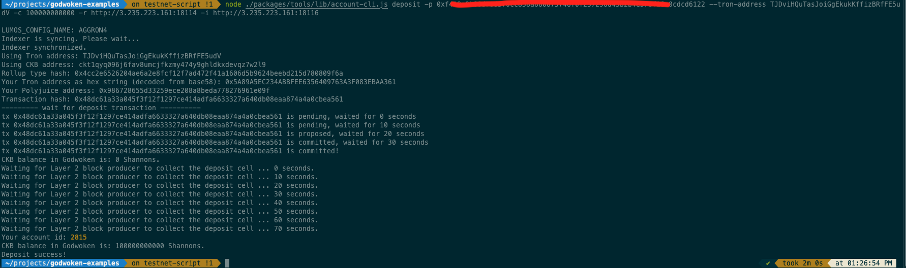
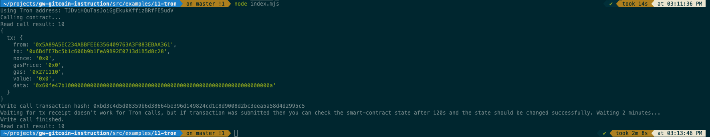

# Task 11 -  Use A Tron Wallet To Execute A Smart Contract Call
---
## 1) A screenshot of the accounts you created (account list) in ckb-cli:

---
## 2) A link to the Layer 1 address you funded on the Testnet Explorer:
https://explorer.nervos.org/aggron/address/ckt1qyq096j6fav8umcjfkzmy474y9ghldkxdevqz7w2l9
---
## 3) A screenshot of the console output immediately after you have successfully submitted a CKByte deposit to your Tron account on Layer 2:

## 4) A screenshot of the console output immediately after you have successfully issued a smart contract calls on Layer 2:

---
## 5) The transaction hash from the console output:
```
0xbd3c4d5d08359b6d38664be396d149824cd1c8d9008d2bc3eea5a58d4d2995c5
```
---
## 6) The contract address that you called:
```
0x6B4FE7bc5b1c606b9b1FeA9B92E0713d1B5d8c28
```
---
## 7) The ABI for contract you made a call on:
```
[
    {
      "inputs": [],
      "stateMutability": "payable",
      "type": "constructor"
    },
    {
      "inputs": [
        {
          "internalType": "uint256",
          "name": "x",
          "type": "uint256"
        }
      ],
      "name": "set",
      "outputs": [],
      "stateMutability": "payable",
      "type": "function"
    },
    {
      "inputs": [],
      "name": "get",
      "outputs": [
        {
          "internalType": "uint256",
          "name": "",
          "type": "uint256"
        }
      ],
      "stateMutability": "view",
      "type": "function"
    }
  ]
```
---
## 8) Your Tron address:
```
TJDviHQuTasJoiGgEkukKffizBRfFE5udV
```
