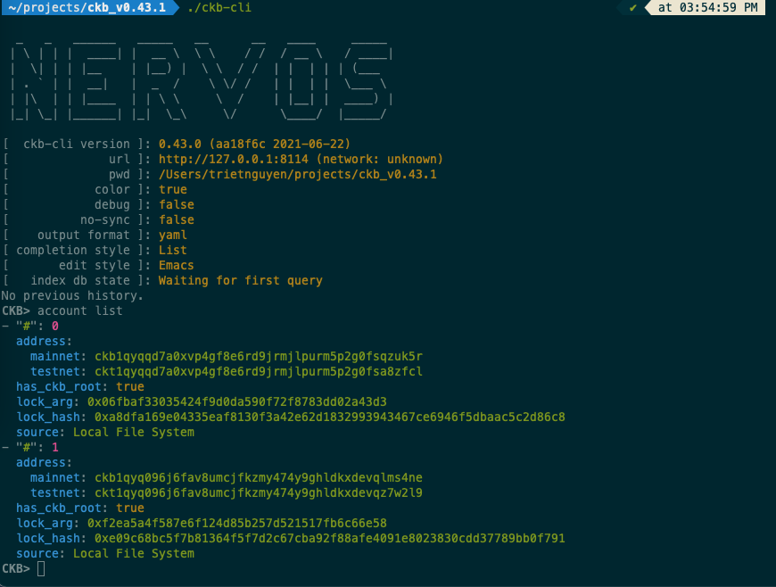

# Task 11 -  Use A Tron Wallet To Execute A Smart Contract Call
---
## 1) A screenshot of the accounts you created (account list) in ckb-cli:

---
## 2) A link to the Layer 1 address you funded on the Testnet Explorer:

---
## 3) A screenshot of the console output immediately after you have successfully submitted a CKByte deposit to your Tron account on Layer 2:

## 4) A screenshot of the console output immediately after you have successfully issued a smart contract calls on Layer 2:

---
## 5) The transaction hash from the console output:
```
```
---
## 6) The contract address that you called:
```
```
---
## 7) The ABI for contract you made a call on:
```

```
---
## 8) Your Tron address:
```
```
