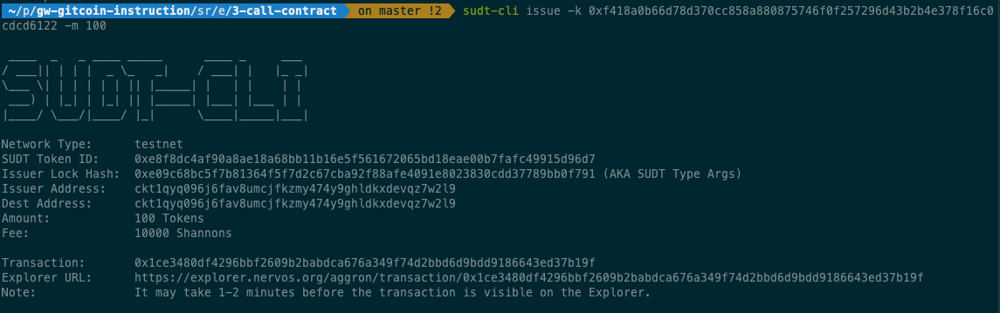
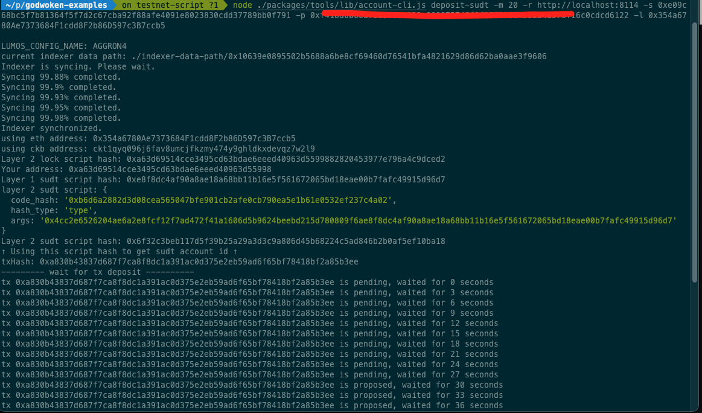
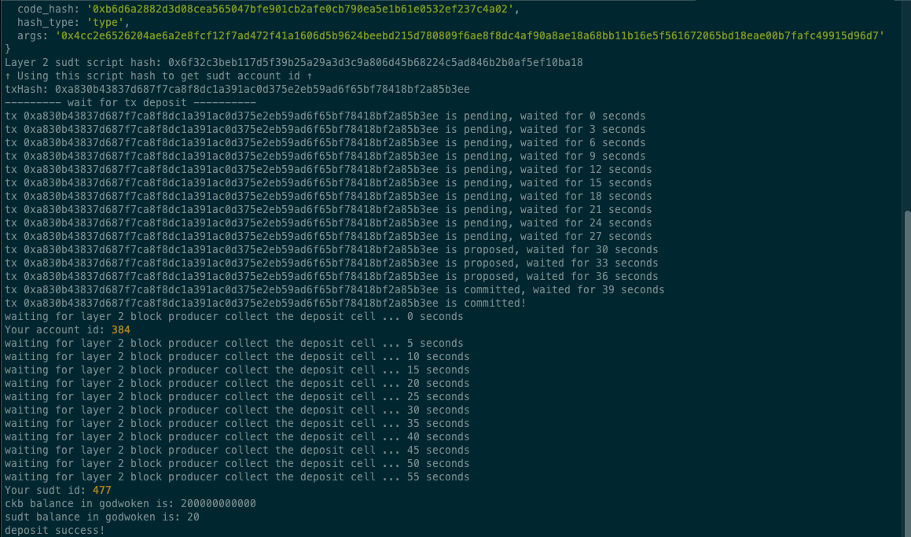

# Nervos04

# Layer 1 address on the testnet explorer

https://explorer.nervos.org/aggron/address/ckt1qyq096j6fav8umcjfkzmy474y9ghldkxdevqz7w2l9

# Screenshot of the console output after using sudt-cli to create SUDT tokens on layer 1



# Link to the transaction on the testnet explorer

https://explorer.nervos.org/aggron/transaction/0x1ce3480df4296bbf2609b2babdca676a349f74d2bbd6d9bdd9186643ed37b19f

# Screenshot of the console output after submitting a deposit to Layer 2



# SUDT ID

```sh
477
```
