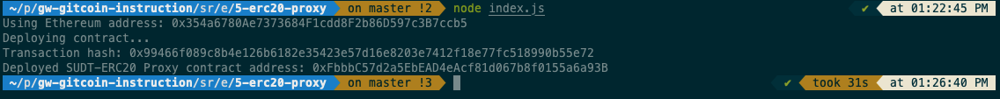
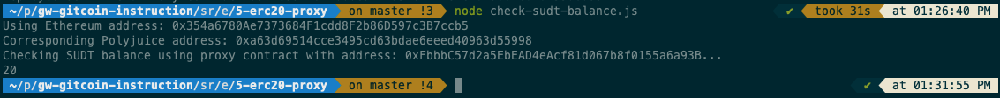

# Gitcoin Task 5

# Screenshot of the console output immediately after deploying smart contract

# Address of the ERC20 Proxy Contract deployed (in text format)

```sh
0xFbbbC57d2a5EbEAD4eAcf81d067b8f0155a6a93B
```

# screenshot of the console output immediately after checking your SUDT balance 


# Ethereum address that was checked (in text format)

```sh
0x354a6780Ae7373684F1cdd8F2b86D597c3B7ccb5
```


