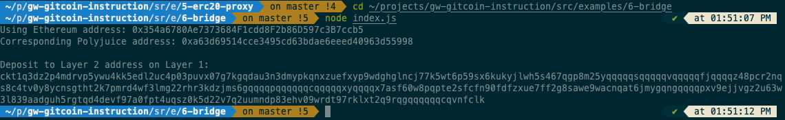

# Task Submission 1



# Task Submission 2

Deposit Receiver Address:

```sh
ckt1q3dz2p4mdrvp5ywu4kk5edl2uc4p03puvx07g7kgqdau3n3dmypkqnxzuefxyp9wdghglncj77k5wt6p59sx6kukyjlwh5s467qgp8m25yqqqqqsqqqqqvqqqqqfjqqqqz48pcr2nqs8c4tv0y8ycnsgtht2k7pmrd4wf3lmg22rhr3kdzjms6gqqqqpqqqqqqcqqqqqxyqqqqx7asf60w8pqpte2sfcfn90fdfzxue7ff2g8sawe9wacnqat6jmygqngqqqqpxv9ejjvgz2u63w3l839aadguh5rgtqd4devf97a0fpt4uqsz0k5d22v7q2uumndp83ehv09wrdt97rklxt2q9rqgqqqqqqcqvnfclk
```

# Task Submission 3

Ethereum Address:

```sh
0x354a6780Ae7373684F1cdd8F2b86D597c3B7ccb5
```

# Task Submission 4

https://rinkeby.etherscan.io/tx/0xbd359b63a19575a3f910451f9f24456510d305a2a92fa9b4767448a2393f444c

# Task Submission 5

https://explorer.nervos.org/aggron/transaction/0x17583556a1d40c7990443a59049d3717ac99d48203f59bc7d0a1913dfc8d55a1
