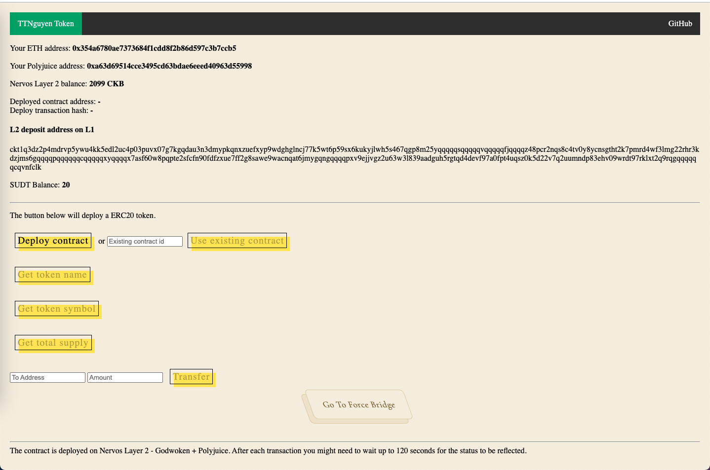

# Task 8

# A screenshot or video of your EVM application on Layer 2 with Force Bridge support.



## Youtube video:
https://www.youtube.com/watch?v=5rARTWyBW5Y

# The address of the SUDT-ERC20 Proxy Contract that you deployed (in text format).
```sh 
0xFbbbC57d2a5EbEAD4eAcf81d067b8f0155a6a93B
```
# A link to the GitHub repository with your EVM application that integrates Force Bridge support.
https://github.com/TTNguyenDev/Dapps-Support-ForceBridge
